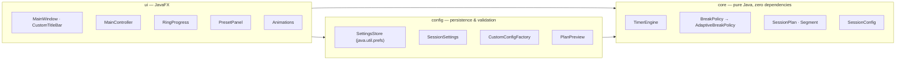

# LitchModoro

**A minimalist, frameless Pomodoro study timer for Windows — with break schedules that adapt to how long you actually plan to study, from 1 to 8 hours.**

Built with Java 21 and JavaFX 21.0.5. No account, no telemetry, no cloud — a small calm window that gets out of your way.

The UI is a single rounded, borderless card: a custom title bar, a big monospace countdown inside a green progress ring, three controls (start/pause, skip, stop), and a slide-in panel where you pick your session length and preview the exact focus/break plan before you start.

## Screenshots

<!-- Screenshots coming soon: main focus screen, break state, and the preset panel with plan preview.
     Drop images under docs/screenshots/ and reference them here, e.g.:
      -->

## Features

| Feature | Details |
|---|---|
| Frameless window | Transparent JavaFX stage, rounded corners with soft shadow, custom title bar (drag to move, minimize, close) |
| Adaptive break policy | Focus/break scheme scales with session length instead of one-size-fits-all 25/5 (bands below) |
| Presets 1–8 h | One-click hourly presets, plus fully custom sessions (total 5–720 min, focus 1–240 min, break 1–60 min) |
| Plan preview | See the exact breakdown — cycles, focus length, breaks — before you commit to a session |
| Persistent settings | Last session length and custom values survive restarts via the Java Preferences API |
| Smooth 60 fps ring | Canvas progress ring interpolated every frame, green for focus / muted sage for rest |
| Reduced-motion flag | `Animations.ENABLED = false` turns every transition into a no-op and snaps the ring instantly |
| Deterministic core | 48 JUnit 5 tests over a pure-Java state machine — no clock, no threads, no sleeps |

### Adaptive break bands

`AdaptiveBreakPolicy` maps your total study time to a rhythm:

| Session length | Focus | Short break | Long break |
|---|---|---|---|
| ≤ 1 h | 25 min | 5 min | — |
| 1–2 h | 25 min | 5 min | 15 min every 4 cycles |
| 2–4 h | 50 min | 10 min | 20 min every half of the planned cycles (at exactly 4 h) |
| 4–7 h | 90 min | 15 min | — |
| 7–8 h | 90 min | 20 min | 45 min every half of the planned cycles |

The bands apply to any total you enter (presets are hourly, custom accepts 5 min to 12 h).

## Architecture



Three decisions carry most of the design:

1. **Tick-driven engine.** `TimerEngine` never reads a clock or spawns a thread — the caller invokes `tick(seconds)`. The whole state machine (`IDLE → FOCUS ⇄ BREAK → … → FINISHED`, plus pause/resume/skip/stop) is a pure function of the tick sequence, which makes the 48 core tests fully deterministic and instant.
2. **Strategy for breaks.** `BreakPolicy` is an interface; `AdaptiveBreakPolicy` implements the bands above. Swapping in a new break philosophy touches one class — the engine and UI don't know or care.
3. **Observer for decoupling.** `MainController` subscribes to `TimerListener` callbacks (`onTick`, `onSegmentStart`, `onFinish`). `core/` has zero JavaFX imports; the UI owns the only `AnimationTimer`, which both renders the ring at frame rate and feeds real elapsed seconds back into the engine.

## Quick start

Prerequisites: **JDK 21+** and **Maven 3.9+**.

```bash
mvn test        # run the 48 JUnit 5 tests
mvn package     # build target/litchmodoro-1.0.0.jar
```

Run from your IDE with main class `com.krailynd.pomodoro.MainApp` — Maven already puts JavaFX 21.0.5 on the classpath. (If you prefer the command line, add `org.openjfx:javafx-maven-plugin` to the build section and use `mvn javafx:run`.)

### Build the Windows app

`jpackage` does not cross-target, so the native build runs on a Windows host.

Prerequisites:

1. **JDK 21+** with `JAVA_HOME` set (provides `jlink` and `jpackage`)
2. **JavaFX jmods** (Windows, 21.0.x) from [gluonhq.com/products/javafx](https://gluonhq.com/products/javafx/) — extract to `C:\javafx-jmods-21.0.5`, set `JAVAFX_JMODS`, or pass `-JavaFxJmodsPath`
3. Maven on `PATH`
4. *(Optional — installer only)* **WiX Toolset 3.x** (3.11+, v3.14 recommended; v4/v5 are not supported by `jpackage --type exe`) with its `bin` on `PATH`

One command, portable app-image (no WiX needed):

```powershell
powershell -ExecutionPolicy Bypass -File packaging\build-windows.ps1
```

→ `dist\LitchModoro\LitchModoro.exe` — a self-contained folder (trimmed jlink runtime: `java.base`, `java.prefs`, `javafx.base`, `javafx.graphics`, `javafx.controls`) you can copy anywhere.

Installer variant:

```powershell
.\packaging\build-windows.ps1 -Installer
```

→ `dist\LitchModoro-1.0.0.exe` with Start Menu entry and desktop shortcut. The script fails with a clear message if WiX is missing.

Other flags: `-JavaFxJmodsPath D:\tools\javafx-jmods-21.0.5`, `-Dest D:\releases`, `-AppVersion 1.0.1`.

## Where this could go

LitchModoro started as a Pomodoro timer, but nothing about the architecture stops it from becoming a broader study companion. Ideas, not promises:

- **Session history & analytics** — log completed sessions and surface streaks, focus trends, best study hours
- **Study heatmap** — a GitHub-style contribution grid for your calendar
- **Soundscapes** — subtle ambient audio during focus blocks, auto-muted on breaks
- **Cross-device sync** — settings and history following you between machines
- **Pluggable break policies** — more `BreakPolicy` implementations (52/17, circadian, exam-cramming) selected per session
- **macOS & Linux packaging** — the core is already pure Java; the build script is the Windows-specific part

If any of these pull you in, open an issue and let's shape it together.

## Contributing

Small fixes, polish, and new break policies are all welcome — see [CONTRIBUTING.md](CONTRIBUTING.md) for setup, style, and PR expectations. For anything bigger than a typo, **open an issue first** so we can agree on the shape before you invest the work. If you're looking for a way in, ask — we'll happily mentor you through a first contribution.

## License

[MIT](LICENSE)
